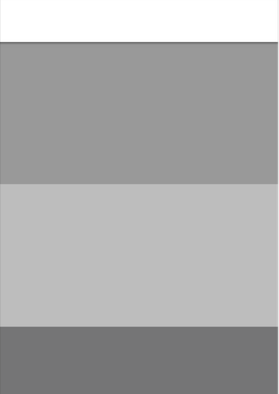
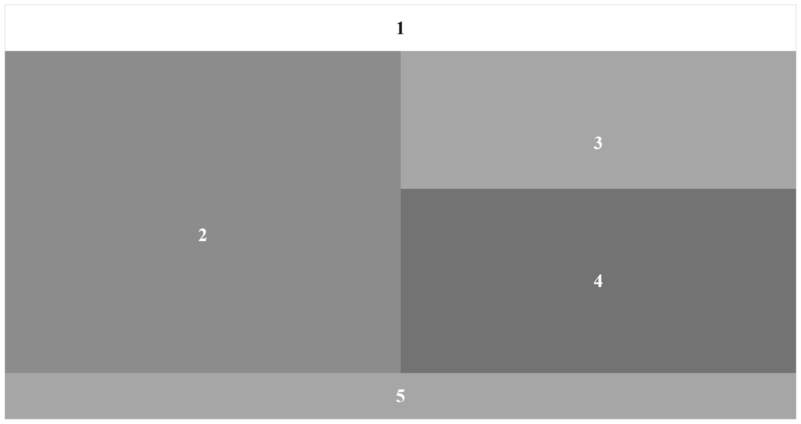
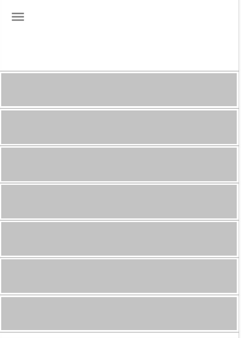
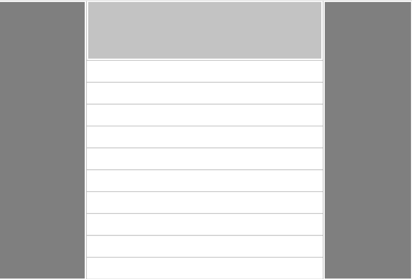

# Exercice 5

1. Reprendre l'exercice 2, Intégrez en HTML et CSS la maquette, ci-après correspondant à la version mobile de [l'exercice 2](./ex2.md).

---

## Maquette Mobile à intégrer (réaliser pour cet exercice)

--- 

## Maquette Desktop correspondante

---

2. Reprendre l'exercice 3, Intégrez en HTML et CSS la maquette ci-après correspondant à la version mobile de [l'exercice 3](./ex3.md).

---

## Maquette Mobile à intégrer (à réaliser pour cet exercice)

--- 

## Maquette Desktop correspondante

