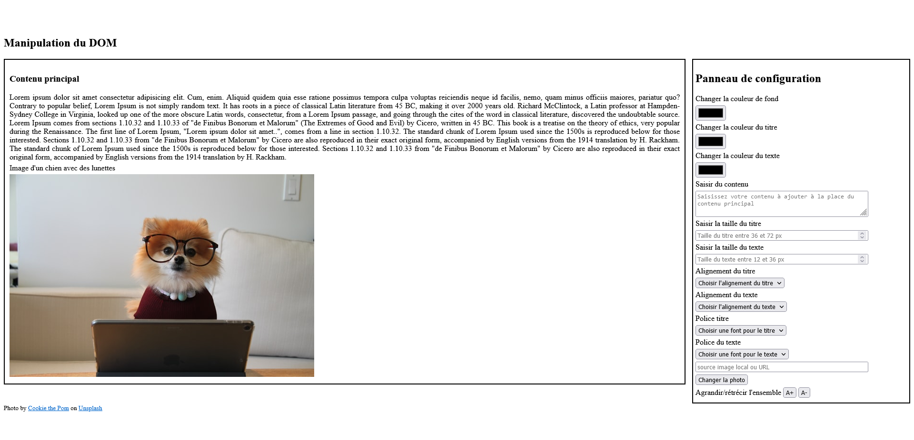
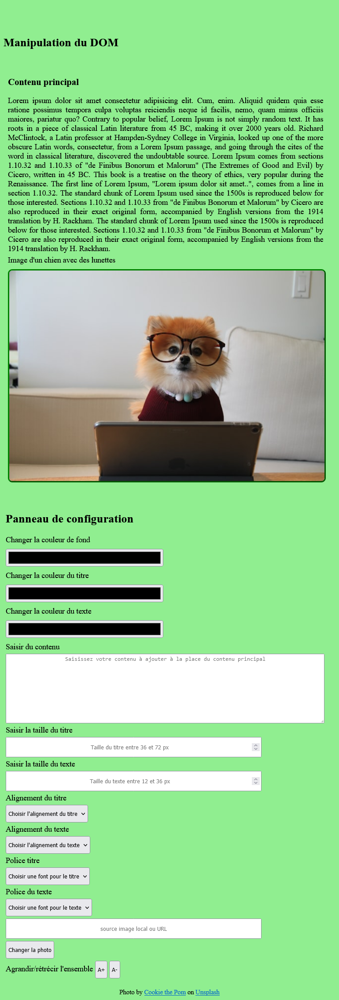

# TP : Responsive Design

---

## Objectifs du TP

1. Créez des pages web en utilisant les langages HTML/CSS

---

## Consigne

**Reproduisez les maquettes ci-dessous**

1. Le bloc de gauche contient : 
- Un titre de niveau 1 ;
- Un texte (copier/coller du [Lorem ipsum](https://www.lipsum.com/)) ;
- Une image [libre de droit unsplash](https://unsplash.com/)).

2. Le bloc de droite contient :
- Un label "couleur de fond" avec un champ de type *color* ;
- Un label "couleur du titre" avec un champ de type *color* ;
- Un label "couleur de texte" avec un champ de type *color* ;
- Un label "contenu" avec un champ de textarea ;
- Un label "taille du titre" avec un champ de type number, taille comprise entre 36px et 72px ;
- Un label "taille du texte" avec un champ de type number, taille comprise entre 12px et 36px ;
- Un label "alignement du titre" avec un select ayant les options droite, gauche, centré et justifié ;
- Un label "alignement du texte" avec un select ayant les options droite, gauche, centré et justifié ;
- Un label "police du texte" avec une sélection  de fonts (polices).

---

### Maquette de la page version desktop (bureau)

---

### Maquette de la page version tablette

---

### Maquette de la page version mobile

