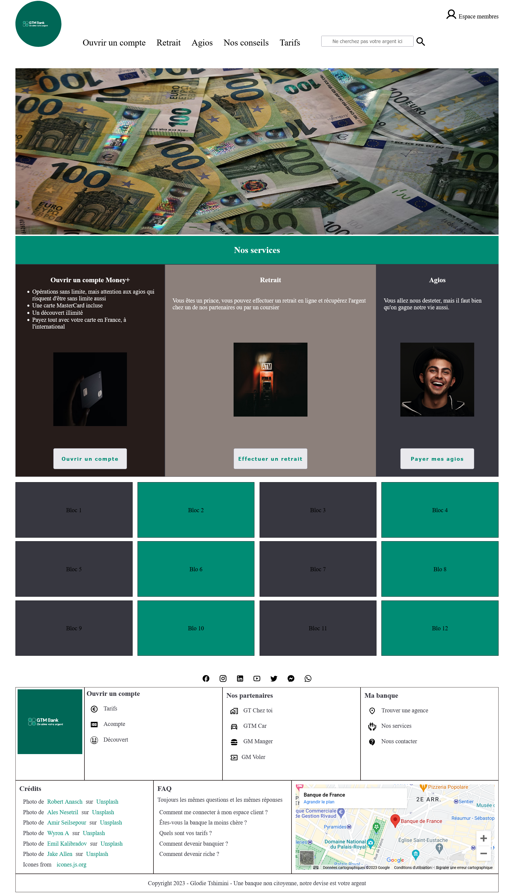

# TP : Mise en page

---

## Ressources

Récupérez le fichier HTML depuis cette [ressource](./ressources/tp1.zip)

---

## Enoncé

1. Réalisez la mise en page suivante sur la version desktop.

2. Adaptez à votre guise la version desktop en mobile

---

## Maquette

