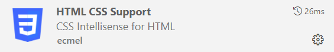

# Installation

---

## Éditeur de code

Installez un éditeur de code de votre choix. Dans le cas échéant, téléchargez et installez [Visual Studio Code](https://code.visualstudio.com/)

---

## Les extensions de Visual Studio Code

- [HTML CSS Support](https://marketplace.visualstudio.com/items?itemName=ecmel.vscode-html-css)

- [Live server](https://marketplace.visualstudio.com/items?itemName=ritwickdey.LiveServer)

---

## Ressources pour les exercices

[Ressources exercices](./0-exercices/README.md)